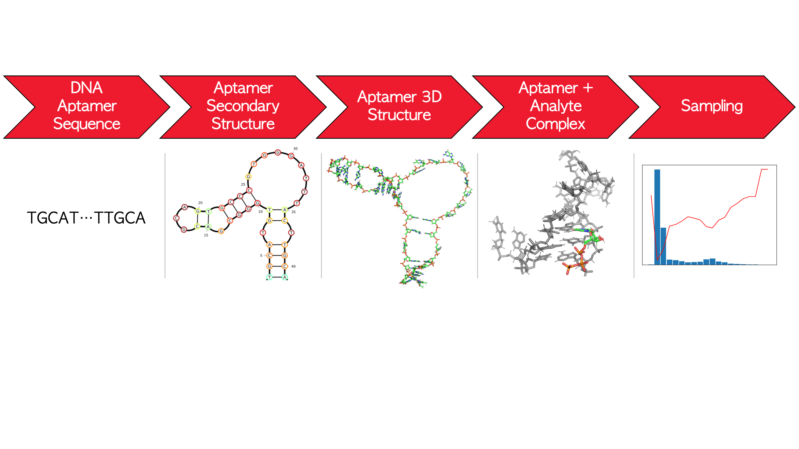

# Summary

DNA aptamers are short sequences of single-stranded DNA. They are starting to play an increasingly larger role in molecular medicine, drug design, and material design due to their strong and selective and most importantly tunable binding affinity to target molecules [@Tucker:2012; @Zhou:2017]. For instance, DNA aptamers can be used as therapeutics [@Corey:2021] for a wide range of diseases such as epilepsy [@Zamay:2020] and cancers [@Morita:2018]. They can also be used to detect a wide variety of molecular ligands, including antibiotics[@Mehlhorn:2018], neurotransmitters[@Sinha:2020], metals[@Qu:2016], proteins[@Kirby:2004], nucleotides[@Shen:2007] and metabolites [@Dale:2021; @Dauphin-Ducharme:2022] in real time even in harsh environments [@McConnell:2020].

We present E2EDNA 2.0: End-2-End DNA 2.0 python simulation pipeline which offers a unified solution to computational modeling of DNA aptamers with molecular ligands. It is broadly aimed at researchers working on developing therapeutics and sensors based on DNA aptamers who require detailed atomistic information about the behavior of aptamers and ligands in solution. Similar to its predecessor E2EDNA [@Kilgour:2021], E2EDNA 2.0 predicts DNA aptamer’s secondary and tertiary structures and if a ligand is present, it predicts the configuration of solvated aptamer-ligand complex. 

# Statement of Need

With E2EDNA 2.0 our goal is to create an all-python simulation package of single-stranded DNA with small ligands that is easy to install and use in python-based workflows. It is an automatic yet flexible pipeline that takes us from DNA aptamer sequence to aptamer-ligand complex. Currently, available softwares designed for computationally studying DNA aptamers predominantly focus on partial feature analyses of RNA and DNA aptamers. For example, APTANI [@Caroli:2016] and APTANI2 [@Caroli:2020], commonly used by the aptamer community, are two methods for selecting potentially relevant aptamers from SELEX (Systematic Evolution of Ligands by EXponential enrichment)[@Tuerk:1990; @McKeague:2014] experimental data sets through a sequence-structure analysis. AEGIS, a platform equipped with a generative deep learning model to propose novel aptamer sequences [@Biondi:2018].  These approaches are aimed at fast black-box analysis of large numbers of sequences. A detailed analysis of a small number of high-promise candidate sequences is often required but no automated and easy-to-use simulation package exists in the computational space aside from E2EDNA[@Kilgour:2021]. 

The gap that E2EDNA family of programs addresses is the absence of a non-black-box one-stop-shop aptamer simulation packages, which are capable of providing in silico predictions of 2D structure, 3D structure, and aptamer-ligand binding simulation while keeping methodology flexible and analysis open-ended. E2EDNA 2.0 achieves this predominantly using python which makes installation and access easier for users than the original E2EDNA package.

# Figure

{ width=100% }

# Components and Features

With E2EDNA 2.0 our goal is to create an all-python simulation package that is easy to install and use in python-based computational workflows. As shown in Figure\autoref{fig:figure_workflow}, the complete simulation pipeline in E2EDNA 2.0 consists of the following main steps: 1. Secondary structure prediction, 2. Tertiary structure prediction, 3. Molecular dynamics simulation, and 4. Aptamer-ligand docking. The input into E2EDNA 2.0 is the DNA sequence in the FASTA format, the structure of the ligand in the pdb format (optional), and the choice of simulation mode. The output includes secondary structure in dot-bracket notation, tertiary structures in pdb format of free aptamer and aptamer-ligand complex (optional), and simulation trajectories in the dcd format. The analysis of the generated data is not performed by E2EDNA 2.0.

Next we briefly discuss the software packages engaged in the E2EDNA 2.0 pipeline. For developers we point out that the pipeline is modular and any of these packages may be easily replaced with any equivalent or competing software. The first module, NUPACK [@Zadeh:2011], generates a predicted secondary structure given DNA FASTA sequence, temperature, and ionic strength. It can output explicit probability of observing the most likely secondary structure for a given sequence, and suboptimal structures and their probabilities for a given sequence. The second module, MarcoMoleculeBuilder (MMB) [@Flores:2011] is a multifunctional software from simTK which allows for rapid directed folding of oligonucleotides and peptides via straightforward inputs on various platforms. MMB initializes a given ssDNA sequence in a single-helix configuration, and folds it according to user-specified base-pairing conditions via simulation with ficticious forces which pull the respective bases together. We include in the software scripts which automatically take in secondary structure instructions from NUPACK in the form of a list of paired bases, and generate MMB command files accordingly. The MMB outputs, as initial structures, are then passed to MD simulation for relaxation. The third module, OpenMM [@Eastman:2017], is the molecular dynamics engine powering E2EDNA 2.0. OpenMM is used to sample 3D structures of both a free aptamer and its aptamer-target complex. The representative DNA aptamer structure is chosen from the MD trajectory via a simple principle component analysis on backbone dihedrals: a free energy is constructed in the space of top-ranked principal components (5) as reaction coordinates and the lowest free energy structure is passed on to the docking with ligand step. The fourth module, LightDock [@Jimenez-Garcia:2018; Roel-Touris:2020], automates the docking between a free DNA aptamer and a given target ligand. LightDock uses a glowworm swarm algorithm; We compute the number of swarms required as being proportional to the approximate surface area of the aptamer and use the best-scored glowwarm as the docked complex structure.

We conclude the presentation of E2EDNA 2.0 by listing the available simulation modes in Table 1. We refer the reader to Documentation for more details on the modes, as well as for installation and running the simulation instructions.

Table 1: E2EDNA 2.0 simulation modes.
1. Mode: '2d structure'; Description: predicts secondary structure.

2. Mode: '3d coarse'; Description: ‘2d structure’ + quick folding into a 3D structure.

3. Mode: ‘3d smooth’; Description: ‘3d coarse’ + MD relaxation.

4. Mode: ‘coarse dock’; Description: ‘3d coarse’ structure  + molecular docking.

5. Mode: ‘smooth dock’; Description: ‘3d smooth’ structure + molecular docking.

6. Mode: ‘free aptamer’; Description: ‘3d coarse’ + MD sampling search for representative aptamer folded conformation.

7. Mode: ‘full dock’; Description: ‘free aptamer’ + molecular docking.

8. Mode: ‘full binding’; Description:‘full dock’ + MD sampling of aptamer-ligand complex.

# Acknowledgements

Funding from the NSERC Discovery grant RGPIN-201924734 and an NSERC PDF for M.K. is greatly appreciated. B.W. and P.R. are grateful for support from the National Institutes of Health (No. R01GM106137). Computations were made on the supercomputer Beluga, managed by Calcul Quebec (https://www.calculquebec.ca/) and Compute Canada (https://www.computecanada.ca/). The operation of this supercomputer is funded by the Canada Foundation for Innovation (CFI).

# References
